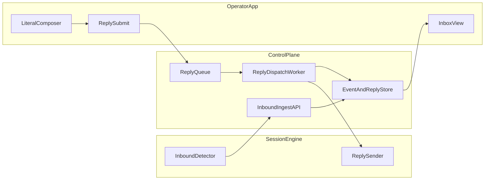

# Master Direction (AI-Facing)

## Objective
Define the canonical direction for evolving this project from a Telegram-centered operator workflow to a structured operator-app workflow, while preserving the existing Facebook session execution engine.

This document is directional. It is not a task-by-task implementation script.

## Current Baseline
- Runtime today is desktop-centered and powered by Electron + Playwright + SQLite.
- Telegram is currently the primary operator interface for notification fanout and reply intake.
- Inbound and outbound reliability already exists in partial form through durable tables and workers.

Authoritative baseline code:
- `desktop/main.js`
- `desktop/services/message-monitor.js`
- `desktop/services/notification-outbox.js`
- `desktop/services/reply-service.js`
- `desktop/db/schema.sql`

## Strategic Direction
Build toward three bounded products:
- `engine/`: session ownership and message execution.
- `control-plane/`: APIs, durable command/event processing, idempotency, queueing.
- `operator-app/`: inbox and literal composer UX.

Shared contracts live in:
- `contracts/`

## Non-Negotiable Rules
- New operator app never owns Facebook credentials.
- Reply routing is deterministic with identifiers, not text inference.
- Literal send is default and enforced (`message_raw` is treated as immutable payload).
- Reliability target is at-least-once delivery with idempotent effects.
- Every send and retry path is auditable.

## Target Dataflow

## Literal Send Policy
- Store exactly what the operator typed as `message_raw`.
- Do not run any transformation layer in send path (no paraphrase, no autocorrect, no templating).
- Compute and persist `message_hash` at acceptance time.
- Verify outgoing payload hash before send confirmation.
- On mismatch, fail hard and mark attempt as validation failure.

## Reliability Model
- Use idempotency keys for `ReplyCommand`.
- Use deduplication at queue boundary and storage boundary.
- Keep dead-letter workflow explicit and replayable.
- Preserve per-conversation ordering (`account_id`, `conversation_id`) where ordering matters.
- Avoid global ordering requirements.

## Program Success Criteria
- Zero cross-conversation misroutes.
- Literal-send fidelity is measurable and enforced.
- Retries are bounded and observable.
- Dead letters are visible and replayable.
- New contributor/AI can onboard from `docs/architecture/*` without reading legacy plans first.

## Document Governance
- Canonical architecture docs:
  - `docs/architecture/MASTER_DIRECTION.md`
  - `docs/architecture/DATA_CONTRACTS.md`
  - `docs/architecture/FOLDER_STRUCTURE.md`
  - `docs/architecture/MIGRATION_PHASES.md`
  - `docs/architecture/DECISION_CHECKLIST.md`
- Historical docs are tracked under `docs/archive/README.md`.

